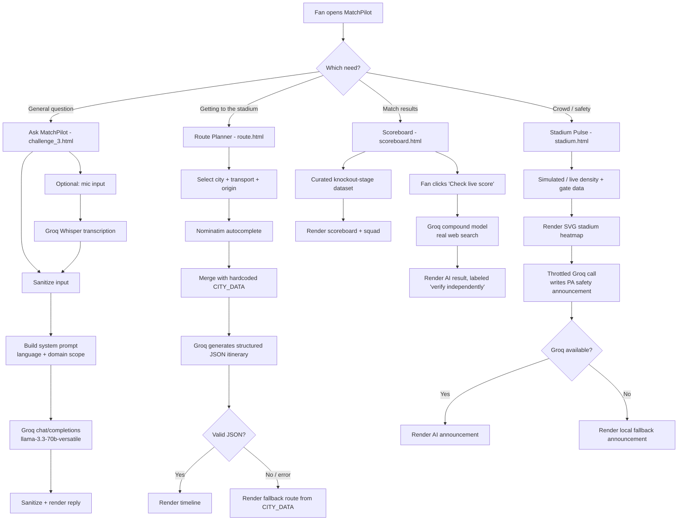

# 🏆 MatchPilot — AI Co-Pilot for FIFA World Cup 2026 Fans

MatchPilot is a multilingual, AI-powered fan companion for FIFA World Cup 2026. It helps fans navigate a tournament spread across **3 countries, 16 cities, and 16 stadiums** — answering questions in their own language, planning match-day routes, tracking live scores, and monitoring real-time stadium crowd safety.

**🔗 Live Demo:** [matchpilot.netlify.app](https://matchpilot.netlify.app/)

## 📋 Table of Contents

- [Problem Statement](#-problem-statement)
- [Our Solution](#-our-solution)
- [Features](#-features)
- [Tech Stack](#-tech-stack)
- [How It Works (Flow)](#-how-it-works-flow)
- [AI / Groq Integration Details](#-ai--groq-integration-details)
- [Project Structure](#-project-structure)

---

## 🎯 Problem Statement

International sporting events like the FIFA World Cup bring together fans who don't speak a common language, don't know the host cities, and have no way to get real-time answers about transport, stadium crowd conditions, or match results — all while info is scattered across official apps, transit websites, and news outlets.

**The challenge:** design and vibe-code a functional AI-first web app that acts as a single assistant for a World Cup fan's entire match day — from "how do I get to the stadium" to "is it safe to enter Gate C right now" to "what was the final score" — usable in multiple languages, with no native app install required.

## 💡 Our Solution

**MatchPilot** is a 4-screen, browser-only web app (HTML/CSS/vanilla JS) that uses **Groq's LLM API** (`llama-3.3-70b-versatile`, plus Groq's web-search-enabled *compound* model for live data) as its reasoning engine, layered on top of real, hand-curated tournament data (host cities, transit routes, knockout-stage results). No backend, no build step — every page is a static file that can be opened directly or hosted on any static site host (GitHub Pages, Vercel, Netlify, etc.).

| Page | File | Purpose |
|---|---|---|
| 💬 Ask MatchPilot | `challenge_3.html` | Multilingual AI chat assistant for general fan questions |
| 🗺️ Match Route Planner | `route.html` | AI-generated, step-by-step travel itinerary to any stadium |
| 🏆 Scoreboard | `scoreboard.html` | Knockout-stage results, squads, and AI live-score lookup |
| 🛡️ Stadium Pulse | `stadium.html` | Real-time crowd density + AI-generated safety announcements |

---

## ✨ Features

### 💬 1. Ask MatchPilot (`challenge_3.html`)
- **Multilingual chat** — answers in 8 quick-select languages (English, Spanish, French, Portuguese, Arabic, Hindi, German, Chinese) with more available via extended locale list; the model is instructed to always reply in the selected language regardless of the language the fan typed in.
- **Voice input** — records audio in-browser (`MediaRecorder`) and transcribes it via **Groq Whisper (`whisper-large-v3-turbo`)**, with automatic language detection (no forced UI-language transcription).
- **Voice output** — reads bot replies aloud using the browser's native `speechSynthesis` API, matched to the correct locale/voice.
- **Inline translator panel** — translate any message between the fan's language and English on demand, with a "speak translation" button.
- **Grounded system prompt** — the assistant is scoped to stadium navigation, transport, schedules, food/vendors, safety, local phrases, sustainability tips, and crowd advice, with explicit facts baked in (e.g. MetLife Stadium has no public parking).
- **Quick-prompt chips** and a clean chat UI with typing indicators and message history (last 10 turns kept as context).

### 🗺️ 2. Match Route Planner (`route.html`)
- Fan picks a **destination stadium/city** and a **transport preference** (rail, rideshare, walk, etc.).
- **Origin autocomplete** powered by **OpenStreetMap Nominatim** (free, no API key) for real address lookup.
- A structured prompt sends the model real, hand-curated `CITY_DATA` per host city (airport transfer instructions, parking warnings, transit lines, CO₂ notes) plus the fan's kickoff time.
- Groq returns a **strict JSON itinerary** (title, duration, cost, CO₂ impact, step-by-step timeline, AI insight, warnings) which is rendered as a visual timeline.
- **Graceful fallback**: if the Groq call fails or returns bad JSON, the page falls back to a route built directly from the hardcoded city facts — so the planner never shows a blank/broken result.
- Backwards-calculated departure time from kickoff, accounting for security-queue buffer.

### 🏆 3. Scoreboard (`scoreboard.html`)
- **Real, hand-curated FIFA 2026 knockout-stage data** — Round of 16 through the Final — for 12 confirmed teams, including results, starting XI, and substitutes. Fields the underlying feed doesn't reliably have (shirt numbers, scorer names, referees, attendance) are deliberately omitted rather than invented.
- **"Check live score with Groq AI"** — uses **Groq's `compound` model**, which performs real server-side web search (via Tavily) rather than guessing from the base model's memory, and returns a structured status (`not_started` / `live` / `finished`), score, and source domain.
- Every AI-fetched result is clearly labeled *"AI-fetched via web search — verify independently"* so it's never presented with the same confidence as the curated dataset.
- Optional auto-refresh (60s interval) for live/upcoming matches, paused when not needed to conserve API credits.
- Team search/filter grid and a detailed per-team scorecard view.

### 🛡️ 4. Stadium Pulse (`stadium.html`)
- Live **SVG stadium visualization** with 4 stands (North/East/South/West), each color-coded by crowd density (safe → caution → critical).
- Gate status indicators (open/closed) per stand.
- **AI-generated PA safety announcements** — Groq is given a live snapshot of stand density and gate status and asked to write a short, calm, specific public-safety announcement (max 3 sentences).
- **Credit-conscious throttling**: routine refreshes are capped to once a minute, urgent (newly-critical) events can trigger a call at most every 25s, and manual refresh has its own 10s cooldown — so the demo doesn't burn API credits needlessly.
- **Local fallback advisory** generated without any API call if Groq is unavailable, so the safety message is never blank.

---

## 🛠️ Tech Stack

| Layer | Technology |
|---|---|
| Structure / Styling | HTML5, CSS3 (custom properties, no framework), Google Fonts (Syne + Inter) |
| Logic | Vanilla JavaScript (ES6+), no build tools, no bundler |
| LLM reasoning | [Groq API](https://console.groq.com) — `llama-3.3-70b-versatile` (chat) |
| Live web search | Groq `compound` model (Tavily-backed web search) for live scores |
| Speech-to-text | Groq `whisper-large-v3-turbo` |
| Text-to-speech | Browser native `SpeechSynthesis` API |
| Geocoding / autocomplete | [OpenStreetMap Nominatim](https://nominatim.org/) (free, no key) |
| Audio capture | Browser `MediaRecorder` + `getUserMedia` |
| Security | Custom `secure-code.js` utility (`MatchPilotSecurity.sanitizeInput`, `escapeHtml`, `escapeHtmlMultiline`) — input sanitization + output escaping to prevent XSS from user text and AI-generated content |
| Hosting | Any static host — GitHub Pages, Netlify, Vercel (no backend/server required) |

---

## 🔄 How It Works (Flow)



---

## 🤖 AI / Groq Integration Details

MatchPilot uses Groq in **four distinct patterns**, intentionally chosen per use case:

1. **Grounded conversational chat** (`challenge_3.html`) — a domain-scoped system prompt with hardcoded tournament facts, so the model answers logistics questions without inventing data it wasn't given.
2. **Structured JSON generation** (`route.html`) — the model is prompted to return *only* a JSON object matching a fixed schema, which the app parses and renders; a non-AI fallback exists in case the model output isn't valid JSON.
3. **Live web-search grounding** (`scoreboard.html`) — uses Groq's `compound` model specifically because it can search the live web (via Tavily) instead of relying on the base model's training data, which is essential for anything time-sensitive like scores. Every AI result is visibly labeled as AI-fetched and not authoritative.
4. **Short, templated generation with rate-limiting** (`stadium.html`) — the model turns a live data snapshot into a natural-language PA announcement, with aggressive throttling so a live/demo environment doesn't burn through API credits.

This mix was a deliberate design choice for the challenge: **use the LLM where judgment/language generation genuinely adds value, and use real data + fallbacks everywhere accuracy matters more than fluency.**

---

## 📁 Project Structure

```
matchpilot/
├── challenge_3.html     # Ask MatchPilot — multilingual AI chat assistant
├── route.html            # AI-powered match-day route planner
├── scoreboard.html       # Knockout-stage scoreboard + AI live-score check
├── stadium.html          # Real-time stadium crowd density + safety advisory
├── secure-code.js         # ⚠️ Required — input sanitization / XSS-escaping utility
└── README.md
```
